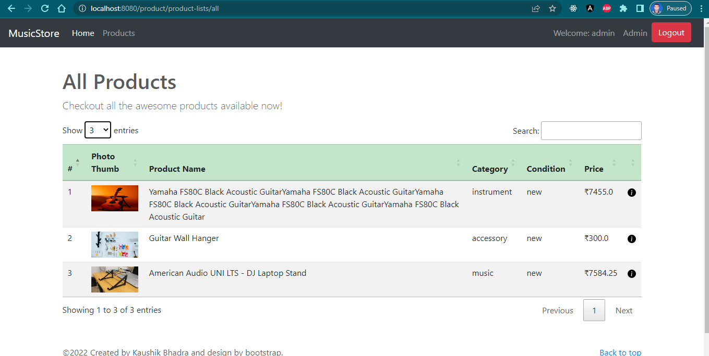

## Music Store

Here, You have found music related `Accessories`,
`Instrument`, `Music-Album`
---
### Demo of Project


---
### For using this application
1. clone this repository
    ````git
   gh repo clone kaushikbhadra/music-store-app
    ````
2. Set Database resources
    - I am using `MYSQL`

   ````java
      spring.datasource.url=jdbc:mysql://hostname:port/database-schema-name
      spring.datasource.username= username
      spring.datasource.password=password
      spring.jpa.properties.hibernate.dialect= YourDatabases (example: `MongoDB`, `Oracle`, `postgresql`)
      spring.jpa.hibernate.ddl-auto=update
    ````
3. Reload Maven Project
    - `right click` project go Maven section.
    - `click reload` project.

4. Run Music Store `main`.

---
#### Live project
Live URL of `music-store`: [music-store](https://loud-wine-production.up.railway.app/)
